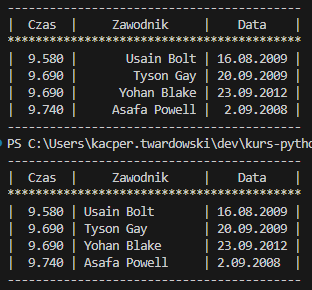
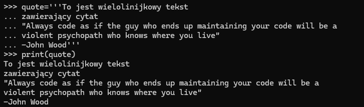
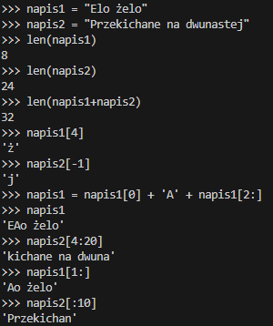

# Python: Start
 Darmowy kurs pythona przygotowany przez Ritę Łyczywek. Kurs można znaleźć na stronie [flynerd.pl](https://www.flynerd.pl/2016/12/python-start.html)

## Lekcje
* [#0 - Start](#0---start)
* [#1 - Konsola](#1---konsola)
* [#2 - Co mi powiesz?](#2---co-mi-powiesz)
* [#3 - Napisy](#3---napisy)
* [#4 - Typy i zmienne](#4---typy-i-zmienne)
* [#5 - Edytujemy napisy](#5---edytujemy-napisy)
* [#6 - Instrukcje warunkowe](#6---instrukcje-warunkowe)
* [#7 - Pętla FOR](#7---pętla-for)
* [#8 - Pętla WHILE](#8---pętla-while)

## #0 - Start
Prosty skrypt z printem i inputem :D

## #1 - Konsola
TO PYTHON OD RAZU MOŻE BYĆ KALKULATOREM? :O

`** – znak potęgowania`
`/ – znak dzielenia`
`% – znak dzielenia modulo`

Widocznie w konsoli Python sam dobiera komendy... przynajmniej do tych prostych.
Ale jak jednak wpiszemy komendy to output będzie bez cudzysłowów.

`\n - znak nowej linii`
`\t - dodanie tabulacji`
`\’ - apostrof`
`\” - cudzysłów`
`\\ - ukośnik`


Można też przypisywać zmienne w konsoli. I mamy też pierwsze zadanie, kalkulator BMI :D


No to mamy pierwsze problemy - nie przetestowałem wpierw potęgowania, co sprawiło mi problemy jak je zaimplementować. I dane źle podałem :/


Teraz zadanie aby to napisać w jednej linii. Ciekawie.


Chyba czegoś nie zrozumiałem... Wpisałem zatem:

```python
print("Twoje BMI jest równe:",78/1.78**2)
```

Czas na zadanie 2 - zapotrzebowanie kaloryczne.


Miałem małę problemy z zadaniem tylko dlatego, że wpisywałem 6,25 zamiast 6.25 - nauczka na przyszłość :D

No i zadanie wykonane poprawnie :D Odpowiedź od autorki znajduje się [tutaj](https://github.com/ritaly/python-1-zabawy-w-konsoli/blob/master/Odpowiedzi/2.py). 
Tak samo jak z wpisaniem BMI w jednej linii :D

A, jeszcze dla siebie miałem... no to szybko.


## #2 - "Co mi powiesz?"
Poznawanie funkcji ("coś ma swoją funkcje – tzn, że spełnia określone zadanie").
* funkcja – to fragment kodu, który wykonuje jakąś sekwencje poleceń. Może przyjmować argumenty.
* argumenty – dane niezbędne do wykonania funkcji


Poznałem również użycie float(input())


Po stworzeniu kolejnego pliku .py pokazane jest jak go otworzyć z poziomu konsoli. Potrzebujemy zatem ścieżki:
`C:\Users\kacper.twardowski\dev\kurs-python-start\2\hello2.py`

Aby nastepnie w konsoli wprowadzić:
`python C:\Users\kacper.twardowski\dev\kurs-python-start\2\hello2.py`

lub: 
`python .\dev\kurs-python-start\2\hello2.py` 

(ponieważ w konsoli znajdujemy się w katalogu `C:\Users\kacper.twardowski`)


Pora na kolejne zadanie :D
```python
print("Hej! Jak się nazywasz?")
imie = input()
print("Witaj",imie+"!\nIle masz lat?")
wiek = input()
print("Młodo wyglądasz :D\nWiesz jaki jest peron z Harrego Potter'a?")
peron = input()
print("Super :D Ale niestety, mając",wiek,"lat nie możesz wejść na peron",peron)
```
Spróbujemy stworzyć własny kod :D
```python
print("Siemanko :D Jak Cię zwą?")
imie = input()
print("Uszanowanie",imie+"!\nCzy gdybyś miał szansę to czy chciałbyś zostać Wiedźminem?")
odp = input()
print("Moim zdaniem Wiedźmin zwany",imie,"byłby nieposkromionym wojownikiem :D")
```

I teraz jako zadania trzeba przerobić kalkulator bmi i program do obliczenia zapotrzebowanie kalorii :D
```python
print("Witaj w kalkulatorze BMI :D")
waga = float(input("Podaj swoją wagę (kg): "))
wzrost = float(input("Podaj swój wzrost (m): "))
print("Twoje BMI wynosi:",waga/wzrost**2)
```
```python
print("Witaj w programie obliczającym zapotrzebowanie kaloryczne dla mężczyzn uprawiających sport kilka razy w tygodniu :D")
waga = float(input("Podaj swoją wagę (kg): "))
wzrost = float(input("Podaj swoją wagę (cm): "))
wiek = float(input("Podaj swój wiek: "))
print("Twoje zapotrzebowanie kaloryczne wynosi:",((10*waga+6.25*wzrost-5*wiek+5)*1.6))
```
## #3 - Napisy
Zapoznanie się z formatowaniem znaków (float, double, long). Jak się okazuje możemy wybrać do ilu miejsc po przecinku ma się liczba pokazać - interpreter sam klasyfikuje format.

Formatowanie tekstu starym i nowym sposobem:


W nowym sposobie możemy w klamrze zawrzeć modyfikator - wskazujemy jak tekst ma być formatowany

```python
>>> print("Rekord świata na 100m to {:.2f} ustanowił go {}".format(9.5877, 'Usain Bolt'))
```
Formatowanie tabelki z kursu dwoma sposobami:



* Stary sposób - nadmiar wolnych znaków = wstawianie spacji od lewej strony
* Nowy sposób - nadmiar wolnych znaków = wstawianie spacji od prawej strony

W starym sposobie mozna to zmienić - wystarczy wprowadzić znak minusa do modyfikatorów.

W nowym sposobie można zamieniać miejscami formaty:
```python
"{} ma {}".format("Ala", "kota")
"{1} ma {0}".format("Ala", "kota")
```

Miejsca można powtarzać i ustawiać dowolnie

Pora na kolejne zadania - konwerter jednostek i lokata :D

Szczerze to nie odnajduję się w lokatach - zapożyczyłem więc wynik z odpowiedzi.
## #4 - Typy i zmienne
Pora na poznanie typów w pythonie :D

I już coś wiem - wiele razy pojawiał mi się error o "tuplach". Teraz wiem, że to są krotki :D Ale co to znaczy?

Cudzysłów potrójny - używany do wielolinijkowych tekstów



Tab+Enter przechodzi do następnej linijki w konsoli :D

* Stringi są niemutowalne = niezmienne.
* Stringi mogą być raw = bez obsługi znaków specjalnych `txt = r"Nowe linie zapisujemy jako \n a tabulatory za pomocą \t"`
* Lista - przechowywalnai różnych elementów ograniczonych przecinkiem. Możemy ją aktualizować.
* Krotka - niezmienialna lista
* Słownik - baza danych "klucz : wartość". Klucz musi być unikalny i niemutowalny.

Można przypisywać kilka zmiennych na raz :O\
Wystarczy wszystkie wypisać po kolei, a potem adekwatnie po znaku '=' wypisać wartości.\
Co ciekawe - Python sam precyzuje typ wartości.

Pora na zadania :D

Po zadaniach: cóż, z pierwszym miałem problem ze zrozumieniem, bo nie sądziłem, że po prostu chodzi o wypisanie zmiennych i przypisanie im wartości. Niepotrzebnie kombinowałem.\
Drugie zadanie z kolei zrobiłem dobrze, ale sobie porównałem do odpowiedzi pani Rity - jest różnica.\ Zapomniałem o istnieniu formatów (zrobiłem o zadanie w większym odstępie czasowym od ostatniej lekcji), a też nie wiedziałem, że mogę tak przypisać nowy element do słownika:

```python
#Wykonanie pani Rity:
new = input('Jaki serial dodać do bazy? ')
rating = input('Jaką ocenę otrzymał ' + new + '? ')
serials[new] = float(rating)

#Moje wykonanie:
new = input("Teraz podaj swój serial \n")
ocena = input("W skali od 1 do 10 na ile go oceniasz? \n")
seriale = {"Arcane" : 9 , "ATLA" : 10, "Rick and Morty" : 8, new : ocena}

#Nie spodziewałem się, że wystarczy po prosty "włożyć" nową zmienną i przypisać do niej wartość - ja po porstu skopiowałem listę i manualnie wkleiłem nowy serial z oceną
```

## #5 - Edytujemy napisy
Teraz czas na głębsze omówienie stringów.

Napis jest typem sekwencyjnym - zmienna może przechowywać wiele wartości.\
Poza tym mamy dostęp do każdego elementu napisu.



Do napisówm można użyc metod, aby przykładowo tekst był napisany dużymi lub małymi literami, albo aby pokazać jego długość czy nawet sprawdzić pewne parametry.


Pora na zadania :D\
Zadanie 1 - troszkę klopotów sprawił mi punkt, gdzie muszę wyświetlić jeden wyraz, ale obszedłem to wycinaniem.\
Zadanie 2 - mimo posiłkowania się na końcu odpowiedzią przy liczeniu cyfr to i tak zrobiłem po swojemu :D\
Zadanie 3 - posiłkowałem się przekonwertowaniem DNA na kod.
## #6 - Instrukcje warunkowe
Teraz czas na warunki i operatory :D

Można łączyć ze sobą operatory w ten sposób:\
`x > 1 and x < 13 or x != 10`

Dla x=10 jest to prawdą, gdyż mamy dwa wyrażenia spełnione - wyznacznikiem tego jest AND. Przy ADN oba wyrażenia muszą być prawdziwe. Drugie wyrażenie jest OR'em, dlatego przy tym wyrażeniu jedna strona może być fałszywa.

Możemy także sprawdzać, czy coś jest w czymś lub coś jest czymś:\
`x in [ 1, 12, 10 ]`\
`x not is 10`\
`'str' is 'string'`

'is' nie jest równe '=='

I mamy teraz if'a - coś co próbowałem wykorzystać w zadaniu z wycinaniem tekstu.\
Większego problemu z pętlą nie mam, dlatego przejdźmy do zadań :D

Zadanie 1 - nie wiem czy dobrze zrozumiałem, ale działa. Potem zerknę na odpowiedź.\
Zadanie 2 - dodanie if'a do BMI.\
Zadanie 3 - tu się posiłkowałem Paint'em :D Musiałem sobie poukładać sortowanie.\
Zadanie 4 - dość proste, wystarczyło zerknąć na poprzednie zadanie z serialami.\
Zadanie 5 - trzeba było sobie przypomnieć własności trójkotów i modulo :D

## #7 - Pętla FOR
Pętla for kojarzy mi się z C++. Dużo zadań w nim przerabiałem w technikum :D\
Tu jednak składnia się różni - zamiast wprowadzać 3 sekcje podajemy tylko zakres.\
Bardziej mi to przypomina tworzenie pętel w twigach. Podajemy nazwę zmiennej dla każdego i-tego elementu w tablicy, albo podajemy zakres od jednego do drugiego elementu (np.: 3-14).\
Ale można również iterować po wartości innej niż liczba - w sensie można podać string czy tupla.\
```python
for i in (1,2,3,4):
    print("krok: ", i)

for i in "ala ma kota":
    print("krok: ", i)
```

Jak się okazuje, można też łatwo napisać pętlę w pętli:\
```python
for i in range(3):
    for j in range(1, 6):
        print(j * "#")
```

Zadanie 1 - i tu mnie już zjadło, ale się nie poddaję. I okazało się, że potrzebuję kolejnej, wcześniej zadeklarowanej zmiennej do sumy.
Zadanie 2 - bardzo proste zadanie :D
Zadanie 3 - w teorii trudne, w praktyce już nie :D Trzeba było przypomnieć sobie o metodzie split()
Zadanie 4- 
## #8 - Pętla WHILE