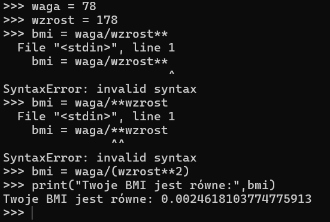

# Python: Start
 Darmowy kurs pythona przygotowany przez Ritę Łyczywek. Kurs można znaleźć na stronie [flynerd.pl](https://www.flynerd.pl/2016/12/python-start.html)

## Lekcje
* [#0 - Start](#0---start)
* [#1 - Konsola](#1---konsola)
* [#2 - Co mi powiesz?](#2---co-mi-powiesz)
* [#3 - Napisy](#3---napisy)
* [#4 - Typy i zmienne](#4---typy-i-zmienne)
* [#5 - Edytujemy napisy](#5---edytujemy-napisy)
* [#6 - Instrukcje warunkowe](#6---instrukcje-warunkowe)
* [#7 - Pętla FOR](#7---pętla-for)

## #0 - Start
Prosty skrypt z printem i inputem :D

## #1 - Konsola
TO PYTHON OD RAZU MOŻE BYĆ KALKULATOREM? :O

`** – znak potęgowania`
`/ – znak dzielenia`
`% – znak dzielenia modulo`

Widocznie w konsoli Python sam dobiera komendy... przynajmniej do tych prostych.
Ale jak jednak wpiszemy komendy to output będzie bez cudzysłowów.

`\n - znak nowej linii`
`\t - dodanie tabulacji`
`\’ - apostrof`
`\” - cudzysłów`
`\\ - ukośnik`


Można też przypisywać zmienne w konsoli. I mamy też pierwsze zadanie, kalkulator BMI :D



No to mamy pierwsze problemy - nie przetestowałem wpierw potęgowania, co sprawiło mi problemy jak je zaimplementować. I dane źle podałem :/


Teraz zadanie aby to napisać w jednej linii. Ciekawie.


Chyba czegoś nie zrozumiałem... Wpisałem zatem:

```python
print("Twoje BMI jest równe:",78/1.78**2)
```

Czas na zadanie 2 - zapotrzebowanie kaloryczne.


Miałem małę problemy z zadaniem tylko dlatego, że wpisywałem 6,25 zamiast 6.25 - nauczka na przyszłość :D

No i zadanie wykonane poprawnie :D Odpowiedź od autorki znajduje się [tutaj](https://github.com/ritaly/python-1-zabawy-w-konsoli/blob/master/Odpowiedzi/2.py). 
Tak samo jak z wpisaniem BMI w jednej linii :D

A, jeszcze dla siebie miałem... no to szybko.


## #2 - "Co mi powiesz?"
Poznawanie funkcji ("coś ma swoją funkcje – tzn, że spełnia określone zadanie").
* funkcja – to fragment kodu, który wykonuje jakąś sekwencje poleceń. Może przyjmować argumenty.
* argumenty – dane niezbędne do wykonania funkcji


Poznałem również użycie float()


Po stworzeniu kolejnego pliku .py pokazane jest jak go otworzyć z poziomu konsoli. Potrzebujemy zatem ścieżki:
`C:\Users\kacper.twardowski\dev\kurs-python-start\2\hello2.py`

Aby nastepnie w konsoli wprowadzić:
`python C:\Users\kacper.twardowski\dev\kurs-python-start\2\hello2.py`

lub: 
`python .\dev\kurs-python-start\2\hello2.py` 

(ponieważ w konsoli znajdujemy się w katalogu `C:\Users\kacper.twardowski`)


## #3 - Napisy


## #4 - Typy i zmienne


## #5 - Edytujemy napisy


## #6 - Instrukcje warunkowe


## #7 - Pętla FOR
